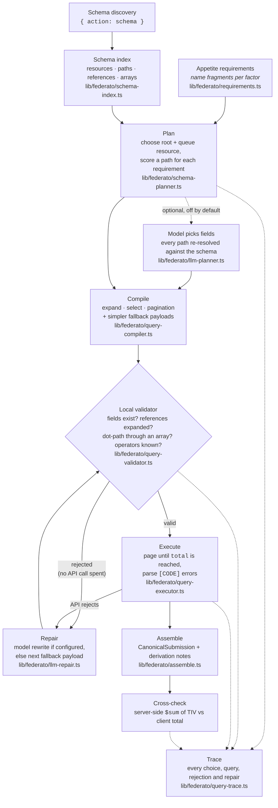

# Federato Underwriting Agent

A restrained MVP for ranking commercial-property submissions against Federato's supplied 2025 appetite guidelines. The application is read-only: it recommends what an underwriter should review and never makes or writes back a binding decision.

It does three things: **ingests** submissions (schema discovery + query, or the captured `raw/` snapshot offline), **enriches** each with external risk data (FEMA National Risk Index hazard ratings per location, shown as separate context that never changes the appetite score), and **produces insights** — a ranked, explained queue you can interrogate in plain English ("ask the queue").

## Ask the queue

An underwriter can type natural-language questions ("why is Harbor Point out of appetite?", "show me new-business property in CA under $100M") and the app answers grounded in the deterministic factors — filtering the live queue or explaining a submission. The LLM only interprets the question and phrases the answer; every fact and row comes from the scoring engine. Set `OPENAI_API_KEY` in `.env.local` to enable it.

## Run locally

```bash
npm install
cp .env.example .env.local
npm run dev
```

By default (no `FEDERATO_USE_DEMO_DATA` set) the app serves the real 158-submission snapshot captured in `raw/`, scored through the same schema-planner + adapter path as live — no credentials needed. Set `FEDERATO_USE_DEMO_DATA=true` for the synthetic fixtures. Open `http://localhost:3000`.

## Query construction pipeline

No Federato field name is written down ahead of time. On every run the agent discovers the schema, works out which field answers each appetite requirement, compiles the query, checks it against the schema **before** sending it, and repairs or simplifies anything that is rejected. Every step is recorded in the trace shown under "Query reasoning" on the dashboard.



The validator is the gate between "a query we composed" and "a query we send". It reads only the discovered schema and enforces the documented query rules:

| Check | Why it matters |
|---|---|
| Every field path exists on its resource | A misspelt field is a wasted round trip and a string error |
| A dot-path never crosses an array | `{"locations.state": "CA"}` silently returns zero rows; the hint rewrites it with `$elemMatch` |
| A reference is only read through once it is in `expand` (or a `$expand` leaf) | Unexpanded references are ids, not records |
| `where` never reads through a reference | `where` runs before expansion; the hint moves the condition to `filter` |
| `$elemMatch` targets an array or an expanded many-reference | Anything else matches nothing |
| Only documented operators, stages, aggregations, sort directions and pagination values | Everything else comes back as `[VALIDATION_ERROR]` from the API |

A rejected payload never reaches Federato. If `FEDERATO_PLANNER_PROVIDER` names a model, the model is shown the schema, the payload and the validator's messages and asked for a rewrite, which is validated again before use; otherwise the executor moves straight to the next, simpler fallback payload. Both paths are traced as repairs. The rules come from the supplied query documentation and have not yet been confirmed against the live API, so a rejection is treated as advice: the queue still loads through a fallback rather than failing.

## Connect Federato

1. Add the organizer-provided client ID, secret, and Auth0 audience to `.env.local`.
2. Set `FEDERATO_USE_DEMO_DATA=false`.

There is no query body to pin: the pipeline above compiles it from the discovered schema. The client uses the PDF-specified endpoints:

- `POST ...federato-hack-north?outputOnly=true` with `{ "action": "schema" }`
- The same endpoint with `{ "action": "query", "payload": { ... } }`
- Auth against `auth.product.federato.ai` rather than the canonical Auth0 domain

See [the implementation plan](docs/MVP_PLAN.md) and the [Person 2 handoff](docs/handover/PERSON_2_HANDOFF.md) for the aggregation rules behind each factor.

## Parallel team handover

Start with [`CLAUDE.md`](CLAUDE.md) and [`docs/HANDOVER.md`](docs/HANDOVER.md). Four equal Claude Code assignments, file ownership, decision boundaries, and completion criteria are defined under [`docs/handover/`](docs/handover/).

When using Conductor, create four workspaces from the same commit and assign one numbered brief to each. Repository scripts use concurrent mode and each local workspace receives its own development port.

## Commands

```bash
npm run dev
npm run typecheck
npm test
npm run build
```
